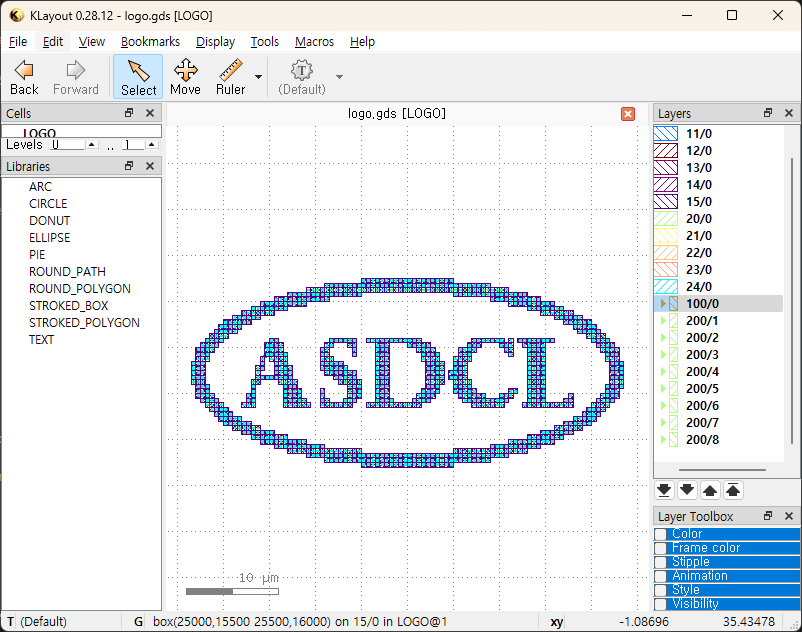

# Logo to GDS/LEF Generator

A Python tool that converts bitmap images (logos) into GDS (GDSII) and LEF (Library Exchange Format) files for integrated circuit design workflows.

## Features

- **Multi-layer Metal Stack Support**: Generates metal layers with proper design rules
- **Via Interconnections**: Automatically places vias between metal layers
- **Diagonal Pattern Detection**: Handles diagonal pixel patterns with optimized filling
- **LEF Generation**: Creates standard LEF files for EDA tool integration
- **Design Rule Compliance**: Respects minimum width, area, and spacing constraints
- **Configurable Parameters**: Adjustable pixel size, threshold, and layer properties

## Notes

- This tool uses generic layer definitions suitable for educational and research purposes
- For production use, replace with actual PDK (Process Design Kit) specifications
- Test with your specific EDA tool flow before production use

## Requirements

```bash
pip install gdspy pillow numpy
```
## Usage

### Basic Usage

```python
from LogoGen import generate_logo_files

# Generate both GDS and LEF files
results = generate_logo_files(
  image_path="logo.bmp",
  constraint_json_path="layer.json",
  output_gds="output/logo.gds",
  output_lef="output/logo.lef",
  macro_name="LOGO_CELL",
  pixel_size_um=0.5,
  threshold_value=180
)
```

### Generate Only GDS

```python
from LogoGen import bitmap_to_stacked_logo

bitmap_to_stacked_logo(
  image_path="logo.bmp",
  constraint_json_path="layer.json",
  logo_cell_name="LOGO_CELL",
  output_gds="logo.gds",
  pixel_size_um=0.5,
  threshold_value=180
)
```

### Generate Only LEF

```python
from LogoGen import generate_lef_from_logo

generate_lef_from_logo(
  image_path="logo.bmp",
  constraint_json_path="layer.json",
  output_lef="logo.lef",
  macro_name="LOGO_CELL",
  pixel_size_um=0.5,
  threshold_value=180
)
```

### Command Line Usage

You can run `LogoGen.py` directly from the command line using the following arguments:

```bash
python LogoGen.py \
  --image logo.bmp \
  --constraints layer.json \
  --output_dir output \
  --macro_name LOGO_CELL \
  --pixel_size_um 0.5 \
  --threshold_value 180
```

- `--image`: Path to the input bitmap image (required)
- `--constraints`: Path to the layer configuration JSON file (required)
- `--output_dir`: Output directory where generated files will be saved (required)
- `--macro_name`: Name of the macro cell in the LEF file (default: `LOGO_CELL`)
- `--pixel_size_um`: Pixel size in micrometers (default: 1.0)
- `--threshold_value`: Threshold for binarizing the image (0-255, default: 128)

The script will generate `logo.gds` (and optionally `logo.lef`) in the specified output directory. Make sure the input image and constraint JSON exist before running the command.

## Usage Example

### Input Logo Image


### Generated Layout Example



You can use your own bitmap image and layer configuration to generate similar results. The example above shows how a simple logo is converted into a GDS layout using the provided scripts and configuration.

## Configuration

### Layer Configuration (layer.json)

The layer configuration file defines the properties of each metal and via layer:

```json
{
  "M1": {
    "layer": 10,
    "datatype": 0,
    "min_width": 0.08,
    "min_area": 0.05,
    "min_spacing": 0.08
  },
  "via1": {
    "layer": 20,
    "datatype": 0,
    "width": 0.08,
    "height": 0.08,
    "spacing": 0.12
  },
  "logo": {
    "layer": 100,
    "datatype": 0
  }
}
```

### Parameters

- **image_path**: Path to input bitmap image (BMP, PNG, JPEG supported)
- **pixel_size_um**: Physical size of each pixel in micrometers
- **threshold_value**: Binary threshold for image conversion (0-255)
- **macro_name**: Name of the generated LEF macro cell
## File Structure

```
ASIC-Logo-Generator/
├── LogoGen.py          # Main script
├── layer.json          # Layer configuration
├── README.md           # Documentation
├── sample/
│   ├── logo.bmp        # Input image example
│   └── LayoutExample.png # Generated layout example
└── output/             # Generated output files
  ├── logo.gds        # Generated GDS file
  └── logo.lef        # Generated LEF file
```

## How It Works

1. **Image Processing**: Converts input image to binary using threshold
2. **Pattern Detection**: Identifies diagonal patterns in 2x2 pixel blocks
3. **Metal Filling**: Fills black pixels with metal layers according to design rules
4. **Via Placement**: Adds vias between consecutive metal layers
5. **File Generation**: Outputs GDS and/or LEF files

## Design Rules

The tool respects semiconductor design rules:
- **Minimum Width**: Ensures metal traces meet minimum width requirements
- **Minimum Area**: Validates minimum area constraints for each shape
- **Spacing**: Maintains proper spacing between metal features
- **Via Rules**: Places vias with proper dimensions and spacing

## Output Files

### GDS File
- Contains geometric shapes on various layers
- Compatible with layout viewers and EDA tools
- Includes metal layers, vias, and exclusion zones

### LEF File
- Standard library format for EDA tools
- Defines macro cell boundaries and obstructions
- Includes power/ground pin definitions
- Compatible with place & route tools

## Example Layer Mapping

| Layer Type | Purpose | Example Uses |
|------------|---------|--------------|
| M1-8 | Routing layers | Signal interconnect |
| via1-7 | Inter-layer vias | Layer connections |
| logo | Logo outline | Visual reference |
| DMxEXCL | Metal dummy exclusion region | Exclusion zones |

## License

MIT License - feel free to use and modify for your projects.

## Contributors

We welcome contributions from everyone!  
Below are the current contributors:


### Jung Nam Kim
[](https://github.com/JungNam-Kim)  
[](https://www.linkedin.com/in/jungnam-kim-b43ba322a/)  
[](https://yoonkim82.wixsite.com/asdl)


## Acknowledgement

This project was developed with significant assistance from GitHub Copilot. The code suggestions and autocompletion features provided by GitHub Copilot greatly improved development productivity. Thank you for the support.